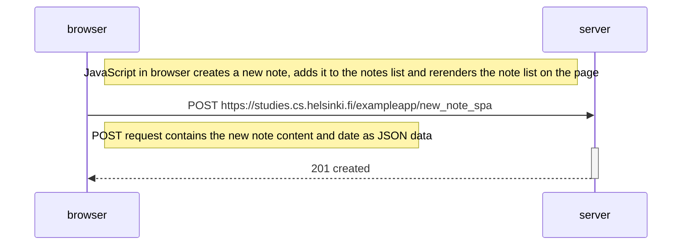

```mermaid
sequenceDiagram
    participant browser
    participant server

    Note right of browser: JavaScript in browser creates a new note, adds it to the notes list and rerenders the note list on the page
    browser->>server: POST https://studies.cs.helsinki.fi/exampleapp/new_note_spa
    Note right of browser: POST request contains the new note content and date as JSON data
    activate server
    server-->>browser: 201 created
    deactivate server

    
```